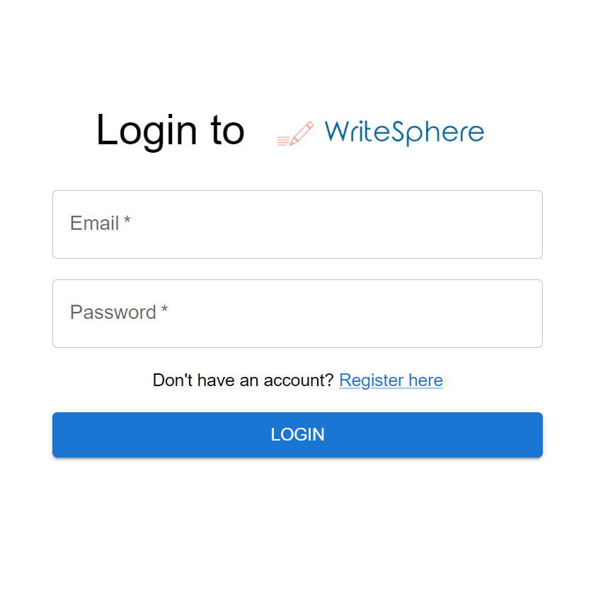
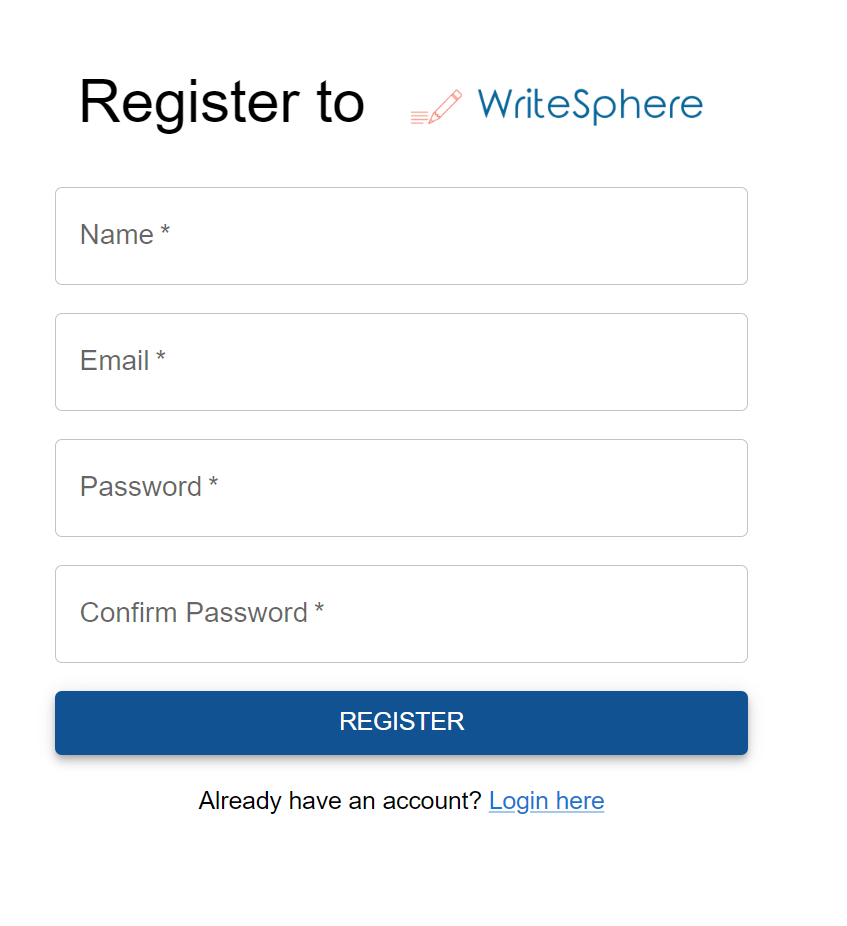
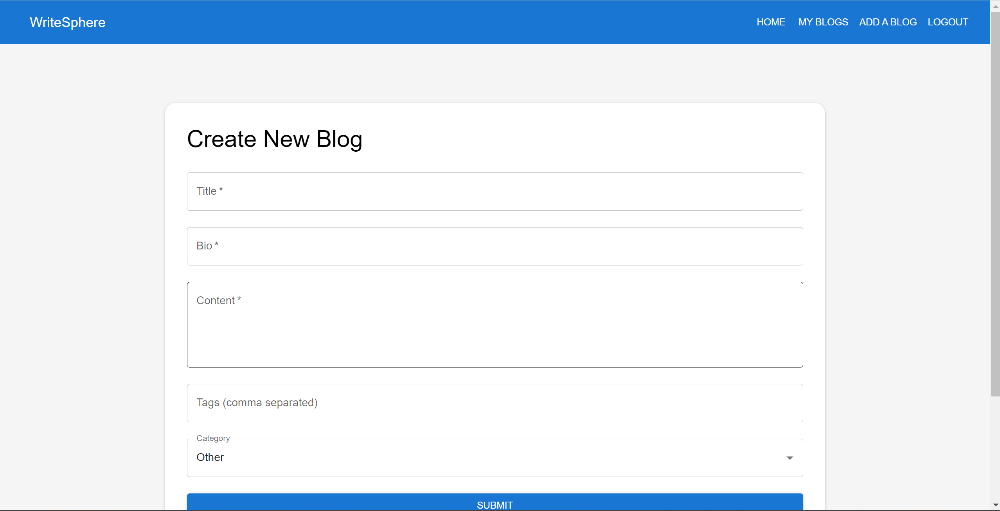
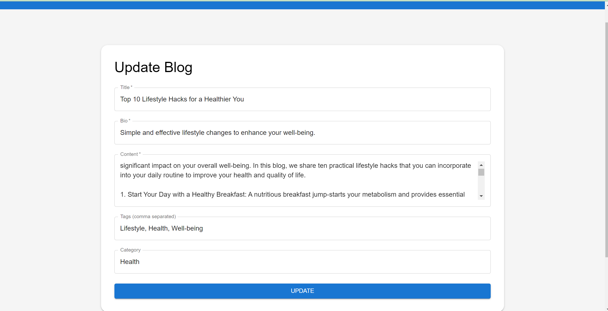

# WriteSphere

WriteSphere is a dynamic and user-friendly blogging application designed to facilitate the creation, management, and discovery of blog posts. Built using modern web technologies, WriteSphere ensures a seamless experience for both authors and readers.

# Features

Create and Manage Blogs: Users can create, edit, and delete blog posts.
Explore Content: Browse through a variety of blog posts categorized into different topics.
User Authentication: Secure login and registration for users.
Responsive Design: A user-friendly interface optimized for various devices.

# Technologies Used:

Frontend: React, Material-UI, React Router
Backend: Node.js, Express
Database: MongoDB
Authentication: JWT (JSON Web Tokens)

# Installation

To set up the project locally, follow these steps:

- Clone the Repository
  git clone https://github.com/ritikanigade13/WriteSphere.git

- Navigate to the Project Directory
  cd Assignment_BlogApp

# Install Dependencies

- For the Backend
  cd server
  npm install

- For the Frontend
  cd ../client
  npm install

- Set Up Environment Variables:
- Create a .env file in the server directory and add the following variables:
- MONGODB_URI=your_mongodb_uri
- JWT_SECRET=your_jwt_secret
- Ensure you replace your_mongodb_uri and your_jwt_secret with actual values.

# Start the Development Server

- For the Backend
  cd server
  npm run dev

- For the Frontend
  cd ../client
  npm start
  The application will be accessible at http://localhost:3000.

# Usage

- Creating a Blog:
- Log In: Ensure you are logged in to create a blog.
- Navigate to the "Create Blog" Page: Click on the "Create Blog" button on the homepage.
- Fill Out the Form: Enter the title, bio, content, tags, and select a category for your blog.
- Submit: Click the "Submit" button to publish your blog post.

- Exploring Blogs
- Navigate to the "Explore Blogs" Page: Click on the "Explore Blogs" button on the homepage.
- Browse: View and read blog posts across different categories.

# Snapshots of project:

# Login

# Register

### Home Page

### Create Blog

# Explore Blogs

# Update

# Contributing

We welcome contributions to improve WriteSphere. To contribute:

Fork the Repository and clone it to your local machine.
git clone https://github.com/ritikanigade13/WriteSphere.git

- Create a New Branch for your changes:
  git checkout -b feature/your-feature
  Make Your Changes and test them thoroughly.

- Commit Your Changes:
  git add .
  git commit -m "Add your message here"

- Push to Your Fork:
  git push origin main
  Open a Pull Request on the main repository to discuss and review your changes.

# Contact

For any questions or issues, please contact nigaderitika13@gmail.com.
